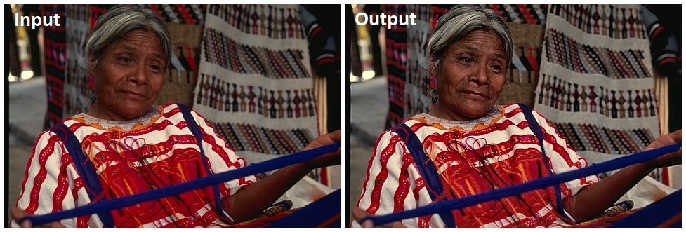
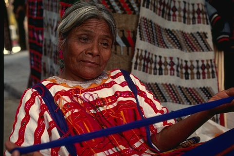

# PACE: Perceptual Adaptive Contrast Enhancement

> A perception-aware image enhancement framework that improves visibility while preserving structural fidelity and natural color balance.

---

## 🔗 Links
[](https://docs.google.com/viewer?url=https://github.com/muhammedshahid/pace-research-paper/raw/main/paper/Perceptual_Adaptive_Contrast_Enhancement_(PACE).pdf)
[](https://github.com/muhammedshahid/pace)
[](https://muhammedshahid.github.io/pace/src)

---

---

## 🚀 Overview

**PACE (Perceptual Adaptive Contrast Enhancement)** is a perception-driven image enhancement framework designed to address the limitations of conventional techniques such as Histogram Equalization (HE), CLAHE, MSRCR, and LIME.

Unlike traditional approaches that often lead to over-enhancement, noise amplification, or color distortion, PACE integrates perceptual color modeling with adaptive parameter control to achieve balanced contrast enhancement while preserving structural and visual fidelity.

It combines:

- perceptual color modeling (**Oklab**)
- adaptive parameter control based on image statistics
- structure-preserving enhancement

Result: **clearer images without over-enhancement, color distortion, or noise amplification.**

---

## 🔥 Features

- Perceptual-aware enhancement (not blind contrast stretching)
- Preserves edges, textures, and structural details
- Adaptive control using global image statistics
- Minimal color distortion (Oklab-based processing)
- Works in **Browser** and **Node.js**
- CLI tool for batch processing
- Debug pipeline with JSON export (for research)

---

## 📸 Visual Results

### Before vs After

<p align="center">
  
</p>

> Comparison between Original and PACE-Enhanced Images.

Example:




---

## 📦 Installation

### Install globally (CLI)

```bash
npm install -g pace
```

### Install locally

```bash
npm install pace
```

---

## ⚡ Quick Start

### Node.js

```js
import { applyPACE } from "pace";

// imageData: ImageData object
const output = await applyPACE(imageData);
```

---

## 🖥 CLI Usage

```bash
pace <input> <output> [options]
```

### Options

- `--debug` → Enable detailed debug logs (exports JSON)
- `--strength <value>` → Control enhancement strength (default: 1.0)
- `--config <file>` → Load JSON config for reproducibility
- `--help` → Show help
- `--version` → Show version

### Examples

```bash
pace input.jpg output.png
pace input.jpg output.png --strength 0.8
pace input.jpg output.png --debug
pace input.jpg output.png --config config.json
```

---

## ⚙️ Configuration (Advanced)

PACE supports reproducible experiments via JSON config:

```json
{
  "strength": 1.0,
  "override": {
    "controlParams": {
        "tileSize": 8,
        "clipLimit": 2.0,
        "globalAlpha": 0.7
    },
    "perceptualParams": {
        "lambda": 0.48,
        "beta": 0.33,
        "tau": 0.68,
        "edgeStabilizer": 0.05
    }
  }
}
```
---

### 🔹 Control Parameters

- **tileSize**  
  Defines the local region size for CLAHE-based enhancement.
  Smaller values → finer local contrast; larger values → smoother enhancement.

- **clipLimit**  
  Controls histogram clipping to prevent over-amplification.
  Higher values → stronger contrast; lower values → reduced noise amplification.

- **globalAlpha (α)**  
  Global enhancement factor derived from **contrast demand, structural confidence, and luminance imbalance**.  
  It regulates the overall strength of enhancement.
  Higher values → stronger enhancement.

---

### 🔹 Perceptual Parameters

- **lambda (λ) — Stability Regulator**  
  Controls nonlinear contrast compression based on **contrast strength and noise energy**.  
  Prevents unstable amplification in high-noise or high-contrast regions.

- **beta (β) — Highlight Protection**  
  Modulates enhancement in bright regions based on **luminance distribution skewness and highlight dominance**, preventing saturation and detail loss.

- **tau (τ) — Tone Limiter**  
  Limits enhancement in low-contrast regions to avoid excessive amplification and noise boosting.

- **edgeStabilizer (k) — Edge Stability Control**  
  Regulates edge enhancement stability based on noise level
  Higher noise → stronger stabilization → reduced artifacts near edges.

---

### 🧠 Interpretation

- **Control parameters** determine the **global and local enhancement behavior**  
- **Perceptual parameters** enforce **visual consistency and stability constraints**

Unless overridden, all parameters are **automatically estimated from global image statistics**, enabling adaptive and data-driven enhancement.

---

## 🌐 Browser Usage

PACE also works in the browser.

Open:

```
src/index.html
```

Features:

- drag & drop image
- real-time enhancement
- visual comparison

---

## 🧪 Examples

Run examples:

```bash
node examples/basic.js
node examples/with-config.js
node examples/batch.js
```

Includes:

- basic usage
- reproducible config setup
- batch processing

---

## 🧪 Testing

Run test suite:

```bash
npm test
```

Tests ensure:

- pipeline stability
- valid output ranges
- deterministic behavior
- config correctness

---

## 🧠 Method Overview

PACE pipeline:

1. RGB → Oklab conversion  
2. Global feature extraction  
3. Adaptive parameter computation  
4. CLAHE-based enhancement  
5. Perceptual blending  
6. Reconstruction  

---

## 📊 Comparison with Existing Methods

PACE is designed to address key limitations of traditional and modern image enhancement techniques by integrating **perceptual modeling, adaptive control, and structural preservation** into a unified framework.

### 🔹 Compared Methods

- **Histogram Equalization (HE)**  
  Global contrast enhancement without spatial awareness.

- **CLAHE (Contrast Limited Adaptive Histogram Equalization)**  
  Local contrast enhancement with clipping control, but lacks perceptual guidance.

- **MSRCR (Multi-Scale Retinex with Color Restoration)**  
  Retinex-based enhancement focusing on illumination correction.

- **LIME (Low-Light Image Enhancement via Illumination Map Estimation)**  
  Illumination estimation-based enhancement, effective but prone to artifacts.

---

### ⚖️ Qualitative Comparison

| Method   | Strengths | Limitations |
|----------|----------|------------|
| **HE**   | Simple, fast | Over-enhancement, loss of local details |
| **CLAHE**| Local contrast improvement | Noise amplification, lacks global coherence |
| **MSRCR**| Illumination correction | Color distortion, halo artifacts |
| **LIME** | Good low-light visibility | Washed-out appearance, chroma inconsistency |
| **PACE (Proposed)** | Adaptive, perceptually guided, structure-preserving | Slightly higher computational cost |

---

### 🧠 Key Advantages of PACE

- **Perceptual Awareness**  
  Unlike HE/CLAHE, PACE incorporates perceptual parameters (λ, β, τ) to regulate enhancement.

- **Structure Preservation**  
  Maintains both **micro and macro structural details**, avoiding over-smoothing and artifacts.

- **Noise-Adaptive Behavior**  
  Dynamically stabilizes enhancement using noise-aware edge control.

- **Balanced Enhancement**  
  Avoids common issues such as:
  - over-saturation (HE)
  - noise amplification (CLAHE)
  - halo artifacts (MSRCR)
  - color inconsistency (LIME)

- **Unified Framework**  
  Combines:
  - histogram-based enhancement  
  - perceptual modeling  
  - adaptive blending  
  into a single pipeline

---

### 📈 Empirical Observations

Visual comparisons indicate that:

- **HE and CLAHE** often over-enhance regions and amplify noise  
- **MSRCR** introduces chromatic inconsistencies and halo effects  
- **LIME** may produce washed-out textures and unstable structures  
- **PACE**, in contrast, achieves:
  - natural color reproduction  
  - consistent contrast  
  - preserved structural fidelity  

---

### 🧪 Summary

PACE bridges the gap between **classical enhancement methods** and **perceptually-driven approaches** by introducing:

> **adaptive parameterization + perceptual constraints + structure-aware blending**

This enables it to function not only as an enhancement algorithm but also as a **reliable preprocessing component for downstream vision systems**.

---

## 📄 Research Paper

Full research details available here:

https://github.com/muhammedshahid/pace-research-paper

---

## 🎯 Applications

- General-purpose image enhancement  
- Preprocessing for computer vision and machine learning pipelines 
- Surveillance & remote sensing  
- Photography and low-light imaging  
- Medical and scientific image analysis imaging  

---

## 📁 Project Structure

```
pace/
├── src/        # core algorithm + browser demo
├── cli/        # command line interface
├── examples/   # usage examples
├── tests/      # test suite
├── package.json
├── README.md
└── LICENSE
```

---

## 📖 Citation

```bibtex
@article{pace2026,
  title={PACE: Perceptual Adaptive Contrast Enhancement},
  author={Muhammed Shahid},
  year={2026}
}
```

---

## 📜 License

MIT License

---

## 🤝 Contributing

Contributions are welcome!  
Feel free to open issues or submit pull requests.

---

## ⭐ Acknowledgment

This work builds upon foundational concepts in:

- Perceptual color spaces (Oklab)  
- Histogram-based contrast enhancement techniques  
- Image quality assessment methodologies  
- Retinex-based illumination modeling  
- Laplacian-based detail enhancement 

---

## 📬 Contact

GitHub: https://github.com/muhammedshahid
