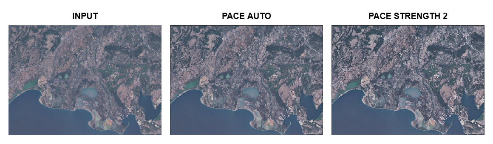

# PACE: Perceptual Adaptive Contrast Enhancement

> A perception—aware image enhancement framework that improves visibility while preserving structural fidelity and natural color balance.
---

## 📊 Interactive Presentation

Understand how PACE works visually — from luminance extraction to adaptive blending.
[](https://muhammedshahid.github.io/pace-presentation/)

---

## 🔗 Links
[](https://docs.google.com/viewer?url=https://github.com/muhammedshahid/pace-research-paper/raw/main/paper/Perceptual_Adaptive_Contrast_Enhancement_(PACE).pdf)
[](https://github.com/muhammedshahid/pace)
[](https://muhammedshahid.github.io/pace/src)
[](https://doi.org/10.5281/zenodo.19203394)
[](https://www.npmjs.com/package/@shahid-labs/pace)
[](https://www.npmjs.com/package/@shahid-labs/pace)


---

## 🚀 Overview

**PACE (Perceptual Adaptive Contrast Enhancement)** is a perception-driven image enhancement framework designed to address the limitations of conventional techniques such as Histogram Equalization (HE), CLAHE, MSRCR, and LIME.

Unlike traditional approaches that often lead to over-enhancement, noise amplification, or color distortion, PACE integrates perceptual color modeling with adaptive parameter control to achieve balanced contrast enhancement while preserving structural and visual fidelity.

It combines:

- perceptual color modeling (**Oklab**)
- adaptive parameter control based on image statistics
- structure-preserving enhancement

Result: **clearer images without over-enhancement, color distortion, or noise amplification.**

---

## 🧠 Method Overview

<p align="center">
  
</p>

> Figure 1: Overview of the proposed Perceptual Adaptive Contrast Enhancement (PACE) framework. The method operates in the OKLab color space and focuses on luminance-guided enhancement through two complementary pathways: (1) a global statistics-driven controller that adaptively estimates enhancement parameters, and (2) a local perceptual stream that generates spatially varying masks. Multiple enhancement cues—comprising CLAHE-based contrast modulation, Retinex-inspired illumination correction, and Laplacian-based texture amplification—are integrated via a perceptually guided blending strategy coupled with a nonlinear stability mechanism, yielding a structurally consistent and visually natural enhanced image.

PACE pipeline:

1. RGB → Oklab conversion  
2. Global feature extraction  
3. Adaptive parameter computation  
4. CLAHE-based enhancement  
5. Perceptual blending  
6. Reconstruction  

---

## ✨ Features

- 🎯 Perceptual-aware enhancement (not blind contrast stretching)
- ⚖️ Preserves edges, textures, structural details along with balanced contrast control
- 🧠 Adaptive control using image statistics (no manual tuning required)
- ❔ Optional configurable parameters for fine-grained control
- 🌈 No color distortion (Oklab-based processing)
- 🧩 Multi-signal fusion (CLAHE, Retinex-inspired, Laplacian)
- 🛡 Artifact suppression & structure preservation
- ⚡ Fast JavaScript implementation (Browser + Node.js + CLI)
- 💻 CLI tool for batch processing
- 🔬 Debug pipeline with JSON export (research-friendly)

---

## 📸 Visual Results

### Quick Demo (Input vs PACE)

<p align="center">
  
</p>

> Figure 2: Visual enhancement result on a real-world portrait captured under suboptimal illumination conditions. (Left) Input image captured under poor illumination. (Right) Output produced by the proposed PACE method. The enhancement improves visibility in facial regions and clothing while preserving natural color tones and avoiding over-enhancement artifacts such as haloing and noise amplification. The result demonstrates PACE’s ability to achieve perceptually balanced contrast without degrading structural details.

### Comparative Evaluation


> Figure 3: Chest X-ray (medical imaging). PACE delivers the most balanced and clinically useful enhancement. Lung vasculature, rib structures, and soft tissues appear sharply defined with excellent local contrast. In contrast, CLAHE and HE aggressively boost contrast, resulting in slight haloing and unnatural brightness around the mediastinum and heart region. LIME tends to darken portions of the image excessively, while MSRCR washes out fine structural details. PACE avoids these limitations and provides the highest diagnostic clarity.

For more detailed visual comparisons, see  
👉 [`examples/comparison`](./examples/comparison)

---

## 🌐 Programmatic Usage

PACE works in **browser (CDN)**, **ES Modules (ESM)**, and **Node.js (CommonJS)**.

### 🚀 Try Live Demo
👉 **[Open Demo](https://muhammedshahid.github.io/pace/src/)**

> The demo includes a simple **Web Worker implementation** to run PACE off the main thread, ensuring smooth UI performance.

---

## 🧠 General API

### `PACE.enhance(imageData, options?, progressCallback?)`
> Alias: `applyPACE(imageData, options?, progressCallback?)`

Enhances an image using the PACE algorithm.

- **imageData**: `ImageData` (RGBA)
- **options** *(optional)*: Configuration object
- **progressCallback** *(optional)*: Function to track processing progress

### ❔ options

```js
options = {
  strength: Number, // range [1, 5]
  debug: Boolean,
  config: JSON 
}
```

> 🔗 See [Options](#options) for available parameters.

#### 🔄 progressCallback

```js
(progress) => {
  // progressObject
  // {
  //   stage: "Compute Params",
  //   index: 3,
  //   total: 7,
  //   time: 0.6,
  //   progressPercent: 42.85
  // }
}
```

> 💡 Useful for UI loaders and progress bars

---

## ⚡ Usage Examples

### 🌐 1. Browser (CDN / Global Script)

```html
<script src="https://cdn.jsdelivr.net/gh/muhammedshahid/pace@v3.1.1/dist/pace.min.js"></script>
<script>
  const enhanced = PACE.enhance(imageData, options, (p) => console.log(p));
</script>
```

---

### 🌐 2. Native Browser (ES Modules)

```html
<script type="module">
  import { PACE, applyPACE } from "https://cdn.jsdelivr.net/gh/muhammedshahid/pace@v3.1.1/dist/pace.esm.js";

  const output = await applyPACE(imageData, options, (p) => console.log(p));
  // OR
  const output2 = await PACE.enhance(imageData, options, (p) => console.log(p));
</script>
```

---

### 📦 3. Node.js (ES Modules)

```js
import { PACE } from "@shahid-labs/pace";

const output = await PACE.enhance(imageData, options, (p) => console.log(p));
```

---

### 📦 4. Node.js (CommonJS)

```js
const { PACE } = require("@shahid-labs/pace");

const output = await PACE.enhance(imageData, options, (p) => console.log(p));
```

---

## 📦 Installation

### Install globally (CLI)

```bash
npm install -g @shahid-labs/pace
```

### Install locally

```bash
npm install @shahid-labs/pace
```

> ⚠️ **Note:** Ensure the project is built before installation.
> If the `/dist` directory is empty, run:
>
> ```bash
> npm run build
> ```
>
> This requires `esbuild` (version `^0.27.4`) as a dependency.

---

## 🖥 CLI Usage

```bash
pace <input> <output> [options]
```

### Options

- `--debug` → Enable detailed debug logs (exports JSON)
- `--strength <value>` → Control enhancement strength (default: 1.0)
- `--config <file>` → Load JSON config for reproducibility
- `--help` → Show help
- `--version` → Show version

> ⚠️ **Note:** The following options are available **only in the CLI** and are not applicable when using PACE programmatically:

- `--help` → Show help  
- `--version` → Show version

---

### Examples

```bash
pace input.jpg output.png
pace input.jpg output.png --strength 0.8
pace input.jpg output.png --debug
pace input.jpg output.png --config config.json
```

---

## ⚙️ Configuration (Advanced)

PACE supports reproducible experiments via JSON config:

```json
{
  "debug": true,
  "strength": 1.0,
  "override": {
    "controlParams": {
        "tileSize": 8,
        "clipLimit": 2.0,
        "globalAlpha": 0.7
    },
    "perceptualParams": {
        "lambda": 0.48,
        "beta": 0.33,
        "tau": 0.68,
        "edgeStabilizer": 0.05
    }
  }
}
```

### 🔹 Control Parameters

- **tileSize**: Local region size for CLAHE
- **clipLimit**: Prevents over-amplification
- **globalAlpha (α)**: Overall enhancement strength

> globalAlpha(α) derived from **contrast demand, structural confidence, and luminance imbalance**. It regulates the overall strength of enhancement. Higher values, stronger enhancement.

### 🔹 Perceptual Parameters

- **lambda (λ)**: Stability regulator
> Controls nonlinear contrast compression based on **contrast strength and noise energy**. Prevents unstable amplification in high-noise or high-contrast regions.
- **beta (β)**: Highlight protection
> Modulates enhancement in bright regions based on **luminance distribution skewness and highlight dominance**, preventing saturation and detail loss.
- **tau (τ)**: Tone limiter
> Limits enhancement in low-contrast regions to avoid excessive amplification and noise boosting.
- **edgeStabilizer (k)**: Edge stability control
> Regulates edge enhancement stability based on noise level. Higher noise → stronger stabilization → reduced artifacts near edges.

### 🧠 Interpretation

- Control parameters → global/local behavior
- Perceptual parameters → visual consistency

**All parameters are automatically estimated unless overridden.**

---

## ⚙️ Web Worker Support (Demo)

The demo includes a simple **Web Worker implementation** to run PACE off the main thread, ensuring smooth UI performance.

### 🚀 Try Live Demo
👉 **[Open Demo](https://muhammedshahid.github.io/pace/src/)**

> 🚀 Enables non-blocking image processing for responsive applications.

### Example

```js
// main thread
const worker = new Worker("worker.js");

worker.postMessage({ imgData, options });

worker.onmessage = (e) => {
  const { type, data, payload, error } = e.data;

  if (type === "PROGRESS") {
    console.log("Progress:", data);
  }

  if (type === "DONE") {
    console.log("Result:", data);
  }

  if (type === "DEBUG_TRACE") {
    // handle trace JSON download in main thread
    console.log("Trace:", payload);
  }

  if (type === "ERROR") {
    console.error(error);
  }
};
```

```js
// worker.js
import { applyPACE } from "../dist/pace.esm.js";

self.onmessage = async (e) => {
  const { imgData, options } = e.data;

  try {
    const result = await applyPACE(imgData, options, (progress) => {
      self.postMessage({ type: "PROGRESS", data: progress });
    });

    // zero-copy transfer
    self.postMessage({ type: "DONE", data: result }, [result.data.buffer]);
  } catch (error) {
    self.postMessage({ type: "ERROR", error: error.message });
  }
};
```

### 🧪 Debug Mode Behavior

When `options.debug = true`, PACE generates a detailed execution trace:

- **Browser (main thread)** → automatically downloads JSON
- **Web Worker** → sends `{ type: 'DEBUG_TRACE' }` to main thread
- **Node.js** → saves trace as a file

> 💡 In Web Workers, you must handle `DEBUG_TRACE` and trigger download manually.


---

## 👀 Strength Parameter Demonstration



**Figure.** Visual comparison of PACE processing on a coastal satellite scene.
**Left:** Input (original image).
**Center:** *PACE AUTO* — output generated without manual parameter tuning.
**Right:** *PACE (strength = 2)* — enhanced output with increased detail refinement.

The progression highlights PACE’s ability to perform **automatic, content-aware enhancement**, while also allowing **controlled amplification of contrast and fine details** through the strength parameter.

> 💡 PACE AUTO operates without manual tuning, making it suitable for fully automated pipelines.

---

## 🔁 Reproducibility

This repository provides:

* ✅ Full JavaScript implementation of **PACE**
* ✅ Scripts to reproduce **baseline comparisons** (HE, CLAHE, MSRCR, LIME)

Baseline methods are implemented using Python and official implementations
to ensure consistency with established literature.

📁 See: [`/reproducibility`](./reproducibility)

---

### ⚙️ Methodology Notes

* HE and CLAHE are applied on the **luminance channel in OKLab space**
  for consistency with PACE
* MSRCR follows a standard multi-scale Retinex formulation
* LIME results are generated using the **official implementation** (unmodified)

---

### 📄 Research Paper

Full methodology, comparisons, and results are documented in:

[](https://docs.google.com/viewer?url=https://github.com/muhammedshahid/pace-research-paper/raw/main/paper/Perceptual_Adaptive_Contrast_Enhancement_(PACE).pdf)

---

### 🔍 Reproducibility Guarantee

* Provided JavaScript implementation (PACE)
* Python scripts in `/reproducibility`
* Fixed parameters and shared methodology

No hidden steps or proprietary tools are used.

---

## 📊 Experimental Results

| Method | MSE ↓ | PSNR ↑ | SSIM ↑ | Entropy ↑ | CII ↑ | NIQE ↓ | BRISQUE ↓ | PIQE ↓ |
|--------|------|--------|--------|----------|----------|----------|----------|----------|
| HE     | 0.0500 | 15.58 | 0.6485 | 10.90 | **1.601** | 3.694 | 22.042 | 41.876 |
| CLAHE  | 0.0229 | 17.26 | 0.7611 | 13.65 | 1.282 | 3.090 | 14.688 | 34.947 |
| LIME   | 0.0510 | 13.09 | 0.7923 | **15.05** | 0.821 | **2.877** | 13.649 | **29.965** |
| MSRCR  | 0.1120 | 9.78  | 0.6573 | 13.43 | 0.399 | 3.417 | **6.792**  | 30.143 |
| **PACE** | **0.0043** | **23.93** | **0.9223** | 14.56 | 1.082 | 3.191 | 12.091 | 39.838 |

✔ PACE achieves:
- **Lowest reconstruction error (MSE)**
- **Highest reconstruction quality (PSNR)**
- **Highest structural similarity (SSIM)**
- **High richness of information/details in the image (Entropy) without introducing noise**
- **Balanced information enhancement**

---

### ⚠️ Insight: Metric Limitations

Although no-reference metrics (NIQE, BRISQUE, PIQE) are widely used:

- LIME and MSRCR often obtain **better scores**
- But produce **chromatic instability and washed-out details**

👉 This highlights a key limitation:
> Objective perceptual metrics do not always align with human visual perception.

PACE is designed to **balance perceptual quality with structural fidelity**, resulting in more stable visual outputs.

---

## 🧪 Examples

Run examples:

```bash
node examples/basic.js
node examples/with-config.js
node examples/batch.js
```

Includes:

- basic usage
- reproducible config setup
- batch processing

---

## 🧪 Testing

Run test suite:

```bash
npm test
```

Tests ensure:

- pipeline stability
- valid output ranges
- deterministic behavior
- config correctness

---

## 📊 Comparison with Existing Methods

PACE is designed to address key limitations of traditional and modern image enhancement techniques by integrating **perceptual modeling, adaptive control, and structural preservation** into a unified framework.

### 🔹 Compared Methods

- **Histogram Equalization (HE)**  
  Global contrast enhancement without spatial awareness.

- **CLAHE (Contrast Limited Adaptive Histogram Equalization)**  
  Local contrast enhancement with clipping control, but lacks perceptual guidance.

- **MSRCR (Multi-Scale Retinex with Color Restoration)**  
  Retinex-based enhancement focusing on illumination correction.

- **LIME (Low-Light Image Enhancement via Illumination Map Estimation)**  
  Illumination estimation-based enhancement, effective but prone to artifacts.


### ⚖️ Qualitative Comparison

| Method   | Strengths | Limitations |
|----------|----------|------------|
| **HE**   | Simple, fast | Over-enhancement, loss of local details |
| **CLAHE**| Local contrast improvement | Noise amplification, lacks global coherence |
| **MSRCR**| Illumination correction | Color distortion, halo artifacts |
| **LIME** | Good low-light visibility | Washed-out appearance, chroma inconsistency |
| **PACE (Proposed)** | Adaptive, perceptually guided, structure-preserving | O(N) runtime; high-resolution images (e.g., 8K) may incur higher latency and memory usage in browser environments (parallelization via Web Workers/GPU planned) |

---

## ⚙️ Computational Complexity

The total computational cost of PACE can be expressed as:

T_PACE(N) = T_features(N) + T_CLAHE(N) + T_signals(N) + T_blend(N)

Each component scales linearly with the number of pixels (N). Therefore, the overall complexity is:

T_PACE(N) = O(N)

This implies that computational cost increases **linearly with image resolution**.

---

## ⚠️ Limitations

- **Linear Complexity (O(N))**
  PACE operates with linear time complexity with respect to the number of pixels, meaning processing time scales proportionally with image resolution.

- **High-Resolution Performance**
  While efficient for typical consumer images (e.g., HD, 4K), very high-resolution inputs (e.g., 8K images or large scientific datasets) may result in increased processing time and memory usage, particularly in browser environments.

- **Single-threaded Execution (Current Implementation)**
  The current implementation primarily relies on single-threaded execution, which can limit performance on large images.

### 🚧 Future Improvements

- **Web Worker Parallelization**
  Offloading computation to Web Workers to enable parallel processing without blocking the UI thread.

- **GPU Acceleration**
  Exploring GPU-based implementations (e.g., WebGL/WebGPU) to significantly accelerate per-pixel operations.

- **Memory Optimization**
  Reducing intermediate buffer usage for large-scale image processing.

---

## 🚀 Practical Efficiency

PACE is designed for **efficient real-world deployment**, with the following properties:

* ⚡ **Linear time complexity** → scalable to high-resolution images
* 🧩 **Local operations** → fixed-size neighbourhood processing
* 🔁 **No iterative optimization** → predictable runtime
* 🧠 **No learning-based components** → low overhead

---

## 🖥️ Parallelization

The algorithm is highly parallelizable and can be efficiently accelerated using:

* **GPU acceleration**
* **SIMD vectorization**
* **Multi-threading** (e.g., Web Workers in browser environments)

---

## 📌 Implications

These characteristics make PACE suitable for:

* Real-time image enhancement
* High-resolution image processing pipelines
* Integration into modern **image processing** and **computer vision** systems

---

## 🧠 Key Advantages of PACE

- **Perceptual Awareness**  
  Unlike HE/CLAHE, PACE incorporates perceptual parameters (λ, β, τ) to regulate enhancement.

- **Structure Preservation**  
  Maintains both **micro and macro structural details**, avoiding over-smoothing and artifacts.

- **Noise-Adaptive Behavior**  
  Dynamically stabilizes enhancement using noise-aware edge control.

- **Balanced Enhancement**  
  Avoids common issues such as:
  - over-saturation (HE)
  - noise amplification (CLAHE)
  - halo artifacts (MSRCR)
  - color inconsistency (LIME)

- **Unified Framework**  
  Combines:
  - histogram-based enhancement  
  - perceptual modeling  
  - adaptive blending into a single pipeline

---

## 📈 Empirical Observations

Visual comparisons indicate that:

- **HE and CLAHE** often over-enhance regions and amplify noise  
- **MSRCR** introduces chromatic inconsistencies and halo effects  
- **LIME** may produce washed-out textures and unstable structures  
- **PACE**, in contrast, achieves:
  - natural color reproduction  
  - consistent contrast  
  - preserved structural fidelity  

---

## 🧪 Summary

PACE bridges the gap between **classical enhancement methods** and **perceptually-driven approaches** by introducing:

> **adaptive parameterization + perceptual constraints + structure-aware blending**

This enables it to function not only as an enhancement algorithm but also as a **reliable preprocessing component for downstream vision systems**.

---

## 🎯 Applications

- General-purpose image enhancement  
- Preprocessing for computer vision and machine learning pipelines 
- Surveillance & remote sensing  
- Photography and low-light imaging  
- Medical and scientific image analysis imaging  

---

## 📁 Project Structure

```
pace/
├── src/                  # Core algorithm (PACE) + browser demo source
├── dist/                 # Bundled builds (CDN, ESM, minified)
├── cli/                  # Command-line interface implementation
├── reproducibility/      # Scripts to reproduce baseline comparisons (HE, CLAHE, MSRCR, LIME)
├── examples/             # Minimal usage examples (Node.js, browser)
├── tests/                # Test suite (unit + functional validation)
├── paper/                # SoftwareX paper (submission manuscript)
├── CITATION.cff          # Citation metadata (GitHub / academic use)
├── package.json          # Project metadata and dependencies
├── package-lock.json     # Dependency lockfile (reproducible installs)
├── eslint.config.js      # Modern flat ESLint config
├── .github/workflows     # GitHub Actions CI (test + build + lint)
├── .gitignore
├── CHANGELOG.md
├── CONTRIBUTING.md
├── README.md             # Project documentation
└── LICENSE               # License information
```

---

## 📖 Citation

```bibtex
@software{pace2026,
  author = {Shahid, Mohd},
  title = {PACE: Perceptual Adaptive Contrast Enhancement},
  year = {2026},
  version = {3.1.1},
  publisher = {Zenodo},
  doi = {10.5281/zenodo.19203394},
  url = {https://doi.org/10.5281/zenodo.19203394}
}
```

---

## 📜 License

MIT License

---

## 🤝 Contributing

Contributions are welcome!  
Feel free to open issues or submit pull requests.

---

## ⭐ Acknowledgment

This work builds upon foundational concepts in:

- Perceptual color spaces (Oklab)  
- Histogram-based contrast enhancement techniques  
- Image quality assessment methodologies  
- Retinex-based illumination modeling  
- Laplacian-based detail enhancement 

---

## 📬 Contact

GitHub: https://github.com/muhammedshahid
