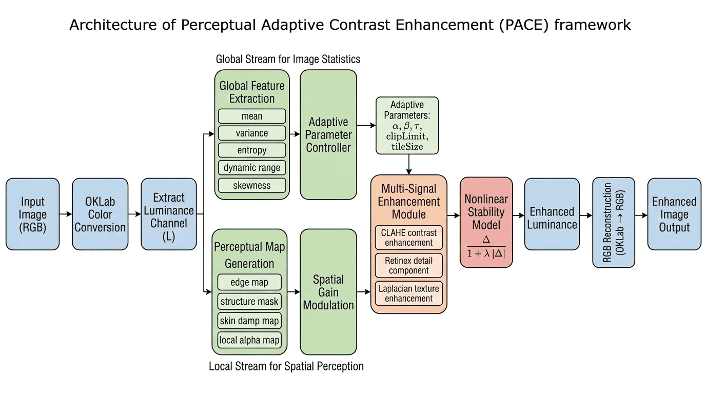
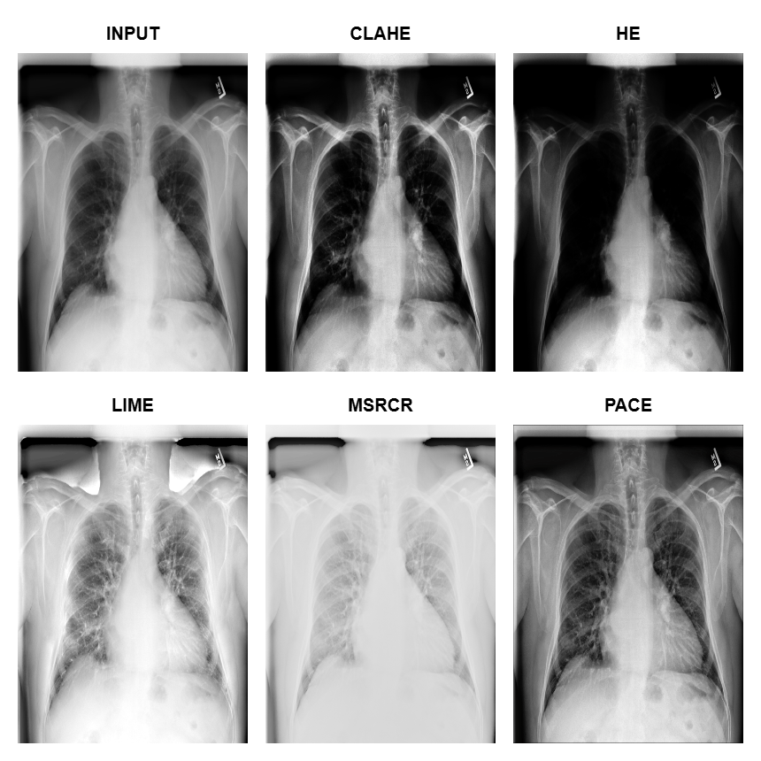
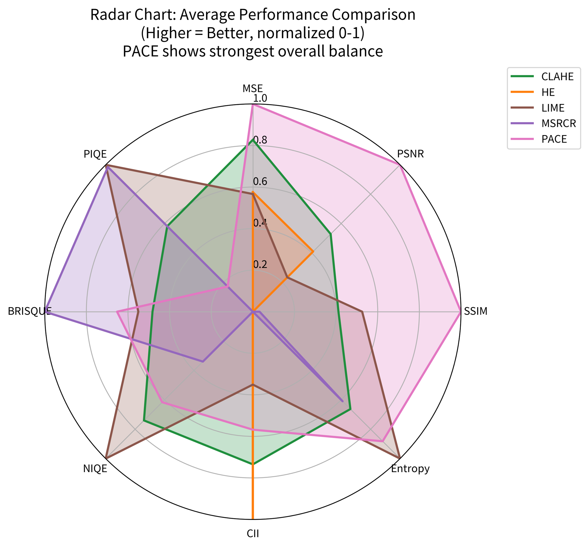

# PACE: A Perceptual Adaptive Contrast Enhancement Software for Robust Image Enhancement

## Abstract

We present PACE (Perceptual Adaptive Contrast Enhancement), a lightweight and fully adaptive software framework for image enhancement. Unlike traditional methods such as Histogram Equalization (HE) and CLAHE, or computationally intensive Retinex-based approaches, PACE integrates global statistical features, local structural awareness, and perceptual multi-signal blending into a unified pipeline. The software is designed for reproducibility, ease of integration, and efficient execution across diverse imaging conditions. Experimental results demonstrate that PACE consistently improves perceptual quality and structural fidelity across standard datasets.

---

## Keywords
Image enhancement; contrast enhancement; adaptive processing; CLAHE; Retinex; perceptual image processing; OKLab

---

## 1. Introduction and Statement of Need

Image enhancement is a fundamental preprocessing step in computer vision and image analysis. Existing approaches such as HE and CLAHE often suffer from over-enhancement and noise amplification, while Retinex-based methods and illumination models (e.g., LIME) introduce computational complexity and visual artifacts such as halo effects.

There is a clear need for a software solution that:

- Adapts automatically to varying image conditions
- Balances enhancement quality with computational efficiency
- Is easy to integrate into real-world pipelines

PACE addresses this gap by providing a fully adaptive, modular, and efficient enhancement framework that combines global distribution analysis with local spatial modulation and perceptual blending.

---

## 2. Software Description

### 2.1 Software Architecture

PACE operates as a structured **global-to-local adaptive enhancement pipeline**, integrating statistical feature extraction, parameter inference, spatial modulation, and perceptual multi-signal blending.



> Figure 1: Overview of the proposed Perceptual Adaptive Contrast Enhancement (PACE) framework. The method operates in the OKLab color space and focuses on luminance-guided enhancement through two complementary pathways: (1) a global statistics-driven controller that adaptively estimates enhancement parameters, and (2) a local perceptual stream that generates spatially varying masks. Multiple enhancement cues—comprising CLAHE-based contrast modulation, Retinex-inspired illumination correction, and Laplacian-based texture amplification—are integrated via a perceptually guided blending strategy coupled with a nonlinear stability mechanism, yielding a structurally consistent and visually natural enhanced image.

### 2.2 Implementation Logic

**Algorithm 1: PACE Enhancement**

**Input:** RGB image \( I \)  
**Output:** Enhanced image \( I_{{enh}} \)

1. Convert \( I \) to OKLab and extract luminance \( L \)  
2. Compute global distribution features  
3. Estimate adaptive parameters  
4. Apply CLAHE for base enhancement  
5. Compute spatially adaptive strength map  
6. Apply multi-signal blending  
7. Reconstruct enhanced RGB image  

### 2.3 Installation

PACE works in **browser (CDN)**, **ES Modules**, and **Node (CommonJS)**.

#### 2.3.1 Browser (CDN / Global Script)

```html
<script src="https://cdn.jsdelivr.net/gh/muhammedshahid/pace@main/dist/pace.min.js"></script>
```

```js
const enhanced = PACE.enhance(imageData, options);
```

#### 2.3.2 ES Modules (Native Browser)

```html
<script type="module"> 
  import { PACE, applyPACE } from "https://cdn.jsdelivr.net/gh/muhammedshahid/pace@main/dist/pace.esm.js";
  const output = await applyPACE(imageData, options); 
  <!-- 
    const output = await PACE.enhance(imageData, options);
  -->
  </script>
```

### 2.3.3 Installation

PACE can be installed via npm:

##### 2.3.3.1 Install globally

```bash
npm install -g pace
```

##### 2.3.3.2 Install locally

```bash
npm install pace
```

### 2.4 Usage

The software accepts an RGB image as input and returns an enhanced image of the same resolution:

#### ES Modules (Bundler / Node.js)

```js
import { applyPACE } from "pace";

// imageData: ImageData object
const output = await applyPACE(imageData, options);
```

OR

```js
import { PACE } from "pace";

// imageData: ImageData object
const output = await PACE.enhance(imageData, options);
```

### 2.5 Features

- Perceptual-aware enhancement (not blind contrast stretching)
- Preserves edges, textures, structural details along with balanced contrast control
- Adaptive control using image statistics (no manual tuning required)
- Optional configurable parameters for fine-grained control
- No color distortion (Oklab-based processing)
- Multi-signal fusion (CLAHE, Retinex-inspired, Laplacian)
- Artifact suppression & structure preservation
- Fast JavaScript implementation (Browser + Node.js + CLI)
- CLI tool for batch processing
- Debug pipeline with JSON export (research-friendly)

### 2.6 Input and Output

- Input: RGB image (Uint8 or Float format)
- Output: Enhanced RGB image

---

## 3. Methodology

PACE operates as a structured global-to-local adaptive enhancement pipeline consisting of:

1. Global feature extraction
2. Adaptive parameter computation
3. Local strength modulation
4. Multi-signal blending

### 3.1 Mathematical Model

#### 3.1.1 Distribution Features

Let \( L = \{L_i\}_{i=1}^{N} \) denote luminance values.

**Mean**

```math
\mu = \frac{1}{N} \sum_{i=1}^{N} L_i
```

**Standard Deviation**

```math
\sigma = \sqrt{\max\left(0, \frac{1}{N} \sum_{i=1}^{N} L_i^2 - \mu^2 \right)}
```

**Normalized Entropy**

```math
H_{\text{norm}} = \frac{- \sum_k p_k \log_2(p_k + \epsilon)}{\log_2(K)}
```

**Dynamic Range**

```math
D = P_{95} - P_{5}
```

**Shadow Ratio**

```math
R_s = \frac{1}{N} \sum_{i=1}^{N} \mathbf{1}(L_i < 0.2)
```

**Highlight Ratio**

```math
R_h = \frac{1}{N} \sum_{i=1}^{N} \mathbf{1}(L_i > 0.8)
```

These features capture global brightness, contrast spread, information content, and illumination imbalance.

#### 3.1.2 Adaptive Parameter Computation

**Contrast Need**

```math
C_{\text{need}} = (1 - H_{\text{norm}})(1 - D)
```

**Structural Confidence**

```math
S_{\text{conf}} = \frac{E_d}{1 + N_r}
```

**Illumination Imbalance**

```math
I_{\text{imb}} = |R_s - R_h|
```

**Adaptive Strength**

```math
\alpha = \frac{0.5 I_{\text{imb}} + 0.3 C_{\text{need}} + 0.4 S_{\text{conf}}}{0.5 + 0.5 I_{\text{imb}} + 0.3 C_{\text{need}} + 0.4 S_{\text{conf}}}
```

This formulation balances contrast demand, structural confidence, and illumination imbalance.

#### 3.1.3 Local Adaptive Strength

**Gradient Magnitude Approximation**

```math
G = \max(|g_x|, |g_y|) + 0.25 \min(|g_x|, |g_y|)
```

**Spatially Adaptive Alpha**

```math
\alpha(x,y) = \operatorname{clip}\left( \alpha \left[1 + 1.2 (C_{\text{loc}} - 0.5)\right], 0.05, 2\alpha \right)
```

This enables spatially varying enhancement while preserving structural consistency.

#### 3.1.4 Multi-Signal Blending

**Refined Alpha**

```math
\alpha' = \alpha (0.8 + 0.8 \alpha_{\text{map}})
```

**Multi-Scale Retinex Component**

```math
R = \log(L_{\text{small}}) - \log(L_{\text{medium}})
```

**Combined Detail Signal**

```math
\Delta = \Delta_c + \eta \, \Delta_d \cdot M_d \cdot M_s \cdot M_e
```

**Final Enhanced Luminance**

```math
L_{\text{enh}} = \operatorname{clip}\left( L + \Delta' \cdot G_e \cdot M_l \cdot G_c, 0, 1 \right)
```

Multiple enhancement signals(Clahe, Retinex & Laplacian) are combined using perceptual weighting to produce the final enhanced luminance.

---

## 4. Results and Evaluation

### 4.1 Experimental Setup

To ensure robust and reproducible evaluation, PACE is tested on a diverse set of images drawn from two widely used benchmarks:

- **LOL Dataset** (low-light image enhancement)
- **BSDS500 Dataset** (natural scenes with structural diversity)

A total of **50 images** are selected, covering:
- low-light conditions  
- high dynamic range scenes  
- texture-rich natural images  

All reported results correspond to the **average performance across all test images**, ensuring statistical reliability.

### 4.2 Visual Comparison

Qualitative comparison of image enhancement results on representative test images from
different domains using the proposed PACE method against state-of-the-art techniques
(CLAHE, HE, LIME, and MSRCR).



> Figure 2: Chest X-ray (medical imaging). PACE delivers the most balanced and clinically useful enhancement. Lung vasculature, rib structures, and soft tissues appear sharply defined with excellent local contrast. In contrast, CLAHE and HE aggressively boost contrast, resulting in slight haloing and unnatural brightness around the mediastinum and heart region. LIME tends to darken portions of the image excessively, while MSRCR washes out fine structural details. PACE avoids these limitations and provides the highest diagnostic clarity.

For more detailed visual comparisons, see  
👉 [`examples/comparison`](../examples/comparison)

### 4.2 Quantitative Comparison

We compare PACE against standard enhancement techniques:

- Histogram Equalization (HE)  
- CLAHE  
- MSRCR (Multi-Scale Retinex with Color Restoration)  
- LIME  

The following metrics are used:

- **MSE**       — pixel-level error
- **PSNR**      — reconstruction fidelity / signal quality
- **SSIM**      — structural similarity & perceptual fidelity
- **Entropy**   — information richness & detail content
- **CII**       — contrast improvement
- **NIQE**      — perceptual naturalness (no-reference)
- **BRISQUE**   — blind spatial quality (natural scene statistics)
- **PIQE**      — perception-based local distortion quality

| Method | MSE ↓ | PSNR ↑ | SSIM ↑ | Entropy ↑ | CII ↑ | NIQE ↓ | BRISQUE ↓ | PIQE ↓ |
|--------|------|--------|--------|----------|----------|----------|----------|----------|
| HE     | 0.0500 | 15.58 | 0.6485 | 10.90 | **1.601** | 3.694 | 22.042 | 41.876 |
| CLAHE  | 0.0229 | 17.26 | 0.7611 | 13.65 | 1.282 | 3.090 | 14.688 | 34.947 |
| LIME   | 0.0510 | 13.09 | 0.7923 | **15.05** | 0.821 | **2.877** | 13.649 | **29.965** |
| MSRCR  | 0.1120 | 9.78  | 0.6573 | 13.43 | 0.399 | 3.417 | **6.792**  | 30.143 |
| **PACE** | **0.0043** | **23.93** | **0.9223** | 14.56 | 1.082 | 3.191 | 12.091 | 39.838 |

> Table 1. Average quantitative performance across test images. For MSE, NIQE, BRISQUE and PIQE, lower values(↓) indicate better performance, whereas higher values(↑) are preferred for PSNR, SSIM, Entropy, CII

To better visualize the results in Table 1, a radar chart is employed.

<p align="center">
  
</p>

> Figure 3: Radar chart comparing the average performance of the evaluated enhancement methods across multiple quality metrics, highlighting the balanced performance of the proposed PACE approach.

### 4.3 Discussion

PACE consistently achieves improved structural fidelity and perceptual quality compared to baseline methods. Unlike global approaches, PACE adapts enhancement strength dynamically, avoiding over-amplification of noise and preserving natural appearance.

### 4.4 Runtime Analysis

PACE demonstrates competitive runtime performance compared to computationally intensive methods such as MSRCR and LIME, making it suitable for real-time and interactive applications.

---

## 5. Use Cases

PACE can be applied in:

- General-purpose image enhancement  
- Preprocessing for computer vision and machine learning pipelines 
- Surveillance & remote sensing  
- Photography and low-light imaging  
- Medical and scientific image analysis imaging  

---

## 6. Reproducibility

Detailed instructions for reproducing results, including dataset preparation and execution steps, are provided in the repository’s reproducibility section.

A subset of 50 images is selected to ensure diversity in illumination, contrast, and scene structure. The selection includes:

- low-light images from LOL dataset  
- natural scenes from BSDS500  

Images are chosen to cover a representative range of visual conditions rather than a fixed predefined split.

> No hidden steps or proprietary tools are used.
---

## 7. Limitations and Future Work

While PACE demonstrates strong performance across a range of imaging conditions, several limitations remain.

The current implementation operates with linear time complexity \( O(N) \), where \( N \) is the number of pixels. Although this ensures scalability, processing time increases proportionally with image resolution. Consequently, very high-resolution inputs (e.g., 8K images or large scientific datasets) may incur higher computational cost and memory usage, particularly in browser-based environments.

In addition, the present implementation primarily relies on single-threaded execution, which limits the utilization of modern multi-core hardware and may affect performance on large-scale inputs.

Future work will focus on improving computational efficiency and scalability. Planned enhancements include parallel processing using Web Workers, GPU acceleration through technologies such as WebGL or WebGPU, and memory optimization strategies to reduce intermediate buffer usage during processing.

These improvements are expected to further enhance the applicability of PACE in real-time and large-scale image processing scenarios.

---

## 8. Conclusion

PACE provides a practical, adaptive, and efficient solution for image enhancement. Its modular design and reproducible implementation make it suitable for both research and real-world applications.
