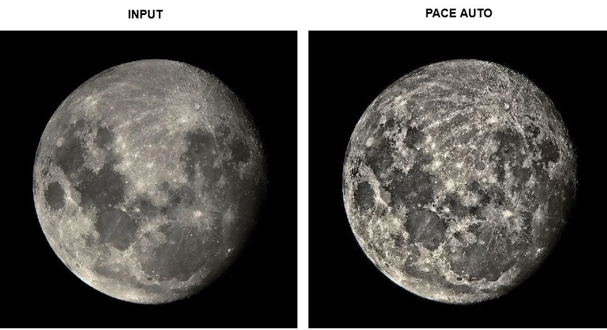

# PACE: A Lightweight Image Adaptive Enhancement Software Framework

**Mohd. Shahid**  
Independent Researcher  
Delhi, India  
Email: smuhammed621@gmail.com

## Abstract

PACE (Perceptual Adaptive Contrast Enhancement) is a lightweight, fully adaptive software framework for robust image enhancement. The system integrates global statistical analysis, local structural modulation, and perceptual multi-signal blending into a unified pipeline. Designed for reproducibility and ease of integration, PACE operates efficiently across diverse imaging conditions without requiring training or manual tuning. The software consistently improves perceptual quality and structural fidelity while maintaining computational efficiency, making it suitable for both research and real-world applications.

## Software Metadata

| Nr | Code metadata description  | *Metadata* |
| :---- | :---- | :---- |
| C1 | Current code version | *v3.1.2* |
| C2 | Permanent link to code/repository used for this code version | *Code repository: [https://github.com/muhammedshahid/pace/](https://github.com/muhammedshahid/pace/)Specific release:[https://github.com/muhammedshahid/pace/releases/tag/v3.1.2](https://github.com/muhammedshahid/pace/releases/tag/v3.1.2)*  |
| C3 | Permanent link to reproducible capsule   | *Not applicable. Reproducibility is ensured via a dedicated package included in the repository, containing Python implementations of baseline methods, a browser-based PACE demonstration (JavaScript), and standardized input datasets (inputs.zip and inputs/ directory) for consistent evaluation and replication.* |
| C4 | Legal code license | *MIT License* |
| C5 | Code versioning system used | *Git* |
| C6 | Software code languages, tools and services used | *JavaScript(ES6+), WebAPIs* |
| C7 | Compilation requirements, operating environments and dependencies | *Compilation requirements: None.  Operating environment: Platform-independent; runs in any modern web browser supporting ES6+. Dependencies: None.* |
| C8 | If available, link to developer documentation/manual | *[https://github.com/muhammedshahid/pace/\#readme](https://github.com/muhammedshahid/pace/#readme)Development & CI Requirements:  Node.js \>= 18 (recommended for tooling compatibility), ESLint (used for code quality checks in CI pipeline)* |
| C9 | Support email for questions | *smuhammed621@gmail.com* |

## 1\. Introduction and Statement of Need

Image enhancement is a critical preprocessing step in computer vision and image analysis. Common approaches such as Histogram Equalization (HE) \[1\] and Contrast Limited Adaptive Histogram Equalization (CLAHE) \[2\] often suffer from over-enhancement and noise amplification, while Retinex-based methods \[3\] introduce computational complexity and may produce visual artifacts. Additionally, model-agnostic techniques such as LIME \[4\], although effective for interpretability, are not designed for direct perceptual enhancement and may not address structural fidelity in image reconstruction tasks.

These limitations highlight the need for an adaptive enhancement framework capable of automatically responding to diverse image characteristics, preserving structural details, maintaining computational efficiency, and integrating seamlessly into existing processing pipelines.

PACE addresses this gap by providing a modular, perceptually guided enhancement framework that combines statistical modeling with adaptive local processing. Unlike learning-based approaches, PACE does not require training data or model optimization, enabling lightweight and consistent performance across a wide range of imaging conditions.

## 2\. Software Description

PACE (Perceptual Adaptive Contrast Enhancement) is a lightweight, fully adaptive image enhancement framework designed for real-time applications. It integrates global statistical analysis, local structural modulation, and perceptual multi-signal blending within a unified processing pipeline. The framework incorporates perceptual color modeling (e.g., OKLab\[7\] space) to improve luminanceā€“chrominance consistency and visual fidelity. Operating without external dependencies, PACE is optimized for browser-based execution, enabling efficient and consistent enhancement across diverse imaging domains, including satellite, medical, and general photography.

### 2.1 Architecture

PACE operates as a structured global-to-local adaptive enhancement pipeline, integrating statistical feature extraction, parameter inference, spatial modulation, and perceptual multi-signal blending.

|  Fig. 1\. Overview of the Perceptual Adaptive Contrast Enhancement (PACE) framework. The method operates in the Oklab color space and combines a global statistics-driven controller with a local perceptual stream. Multiple cuesā€”CLAHE-based contrast, Retinex-inspired illumination, and Laplacian-based detailā€”are fused through perceptually guided blending and nonlinear stabilization. |
| :---- |

PACE follows a global-to-local processing pipeline comprising four primary stages:

1. Global feature extraction    
2. Adaptive parameter estimation    
3. Local modulation    
4. Multi-signal blending

### 2.2 Implementation

The software is implemented in JavaScript and supports browser (CDN), Node.js, ES Modules, and CLI-based batch processing.

### 2.3 Installation and Usage

PACE is distributed via npm and supports execution in browser environments, Node.js, and a command-line interface (CLI) for batch processing.

Installation: 

* **Global (CLI):** npm install \-g @shahid-labs/pace   
* **Local:** npm install @shahid-labs/pace

Core API: 

* PACE.enhance(imageData, options?, progressCallback?)

The CLI enables automated processing:

* pace \<input\> \<output\> \[options\]

A JSON-based configuration system allows automatic parameter estimation with optional overrides for experimental control. Control parameters regulate global and local behavior, while perceptual parameters ensure visual consistency and stability.

Detailed usage examples and full configuration specifications are provided in the project repository.

Example configuration(config.json):

{

  "strength": 1.0,

  "override": {

    "controlParams": {

        "tileSize": 8,

        "clipLimit": 2.0,

        "globalAlpha": 0.7

    },

    "perceptualParams": {

        "lambda": 0.48,

        "beta": 0.33,

        "tau": 0.68,

        "edgeStabilizer": 0.05

    }

  }

}

### 2.4 Features

* **Perceptually guided enhancement:** Adapts contrast using perceptual modeling beyond intensity-based methods.  

* **Structure-preserving enhancement:** Maintains edges, textures, and fine details during contrast adjustment.  

* **Statistically adaptive processing:** Automatically estimates parameters from image-derived statistics.

* **Perceptual color modeling:** Utilizes the OKLab color space to preserve luminanceā€“chrominance consistency.

* **Multi-signal fusion:** Integrates CLAHE-based contrast, Retinex-inspired illumination, and Laplacian detail cues.  

* **Artifact suppression:** Reduces noise amplification and halo artifacts while preserving structural fidelity.  

* **Modular and configurable pipeline:** Supports optional parameter control for reproducibility and experimentation.  

* **Cross-platform execution:** Supports browser, Node.js, and CLI-based processing environments.

## 3\. Methodology

PACE combines global statistical modeling with local perceptual adaptation through a structured processing pipeline consisting of the following stages:

1. Global distribution modeling  
2. Adaptive parameter computation  
3. Spatial modulation  
4. Multi-signal blending

For clarity, only key formulations are presented.

### 3.1 Adaptive Strength

![][image2]

This formulation balances contrast demand (Cneed), structural confidence (Sconf), and illumination imbalance (Iimb)

### 3.2 Spatially Adaptive Strength 

![][image3]

This enables spatially varying enhancement while preserving structural consistency.

### 3.3 Combined Detail Signal 

![][image4]

### 3.4 Final Enhanced Luminance

![][image5]

Multiple enhancement signals (CLAHE, Retinex, and Laplacian-based components) are integrated using perceptual weighting to produce the final enhanced luminance.

The key variables used in the formulation are defined as follows:

*  denotes the global adaptive enhancement strength, and (x, y) represents its spatially varying counterpart. imbalance Iimb denotes illumination imbalance, Cneed represents contrast demand, and Sconf indicates structural confidence. Cloc is the local contrast measure at pixel (x, y).  
*  denotes combined detail enhancement signal, where C represents contrast-driven enhancement and d denotes detail enhancement.   is a weighting factor controlling the contribution of detail enhancement. Md , MS , Me represent detail, structure, and edge modulation maps, respectively.  
* L denotes the input luminance, and Lenh represents the enhanced luminance. ' is the refined enhancement signal after modulation. Ge , Ml , Gc denote edge gain, luminance modulation, and contrast gain functions, respectively.

## 4\. Performance Evaluation

PACE is evaluated on the LOL \[5\] and BSDS500 \[6\] datasets using a combination of full-reference and no-reference image quality metrics.

The evaluation metrics include:

1. **Mean Squared Error (MSE):** Measures pixel-level reconstruction error.    
2. **Peak Signal-to-Noise Ratio (PSNR):** Assesses reconstruction fidelity and signal quality.    
3. **Structural Similarity Index (SSIM):** Evaluates structural similarity and perceptual fidelity.    
4. **Entropy:** Quantifies information richness and detail content.    
5. **Contrast Improvement Index (CII):** Measures enhancement in image contrast.    
6. **Natural Image Quality Evaluator (NIQE):** Assesses perceptual naturalness without reference images.    
7. **Blind/Referenceless Image Spatial Quality Evaluator (BRISQUE):** Evaluates spatial quality based on natural scene statistics.    
8. **Perception-based Image Quality Evaluator (PIQE):** Measures local perceptual distortion.

### 4.1 Experimental Results

**Table 1\.** Average quantitative performance across 50 test images, comparing PACE with baseline methods using standard image quality metrics. Arrows indicate optimization direction (  higher is better,  lower is better).

| Method | MSE  | PSNR  | SSIM  | Entropy  | CII  | NIQE  | BRISQUE  | PIQE  |
| :---- | :---- | :---- | :---- | :---- | :---- | :---- | :---- | :---- |
| **HE** | 0.0500 | 15.58 | 0.6485 | 10.90 | **1.601** | 3.694 | 22.042 | 41.876 |
| **CLAHE** | 0.0229 | 17.26 | 0.7611 | 13.65 | 1.282 | 3.090 | 14.688 | 34.947 |
| **LIME** | 0.0510 | 13.09 | 0.7923 | **15.05** | 0.821 | **2.877** | 13.649 | **29.965** |
| **MSRCR** | 0.1120 | 9.78 | 0.6573 | 13.43 | 0.399 | 3.417 | **6.792** | 30.143 |
| **PACE** | **0.0043** | **23.93** | **0.9223** | 14.56 | 1.082 | 3.191 | 12.091 | 39.838 |

PACE achieves the lowest MSE and highest PSNR and SSIM, indicating improved reconstruction accuracy and structural fidelity. Results demonstrate consistent improvements in perceptual quality under identical evaluation conditions.

### 4.2 Metric Limitations and Perceptual Consistency

Although no-reference metrics such as NIQE, BRISQUE, and PIQE are widely used for perceptual quality assessment, they do not always correlate with human visual perception. In several cases, methods such as LIME and MSRCR achieve more favorable scores on these metrics, yet exhibit chromatic instability and loss of structural detail, often resulting in visually washed-out outputs.

This observation highlights a fundamental limitation of objective perceptual metrics, as they may not fully capture the balance between contrast enhancement, structural fidelity, and visual naturalness.

PACE is designed to address this gap by integrating perceptual modeling with structural constraints, enabling more stable and visually consistent enhancement across diverse imaging conditions.

### 4.3 Comparative Evaluation

Comparative results indicate that while baseline methods may optimize specific metrics, PACE provides more consistent and perceptually stable outputs by effectively balancing enhancement and structural preservation.

|  Fig. 2\. Chest X-ray (medical imaging). PACE delivers the most balanced and clinically useful enhancement. Lung vasculature, rib structures, and soft tissues appear sharply defined with excellent local contrast. In contrast, CLAHE and HE aggressively boost contrast, resulting in slight haloing and unnatural brightness around the mediastinum and heart region. LIME tends to darken portions of the image excessively, while MSRCR washes out fine structural details. PACE avoids these limitations and results in improved visual clarity and structural visibility. |
| :---- |

## 5\. Impact and Reuse Potential

PACE supports applications in remote sensing, medical imaging, and general computer vision pipelines. It enhances low-contrast features while preserving natural appearance.

|  Fig. 3\. Visual comparison of PACE processing on a coastal satellite scene. Left: original input image. Center: PACE AUTO output without manual tuning. Right: PACE (strength \= 2\) output with enhanced structural detail. |
| :---- |

|  Fig. 4\. Visual comparison of lunar surface detail before and after PACE enhancement. Left: original image. Right: PACE-enhanced output demonstrating improved contrast, enhanced micro-texture recovery, and clearer delineation of surface features with controlled luminance. |
| :---- |

The framework is designed for reproducibility through configuration-driven execution, diagnostic parameter export, and batch processing support.

## 6\. Reproducibility

Detailed reproduction instructions, including dataset preparation and execution steps, are provided in the repository. A subset of 50 images is selected to ensure diversity in illumination, contrast, and scene structure, including low-light images from the LOL dataset and natural scenes from BSDS500. The selection emphasizes representative visual conditions rather than a fixed predefined split. A representative subset is used; equivalent results can be reproduced using the provided pipeline and datasets. The pipeline relies solely on the provided code and configuration, with no hidden steps or proprietary tools.

## 7\. Limitations and Future Work

### Limitations

* **Computational scalability:** Although the algorithm exhibits linear time complexity with respect to the number of pixels, processing very high-resolution images (e.g., multi-megapixel or 4K+) may still result in increased execution time in real-time scenarios.  
* **Single-threaded execution model:** The current implementation primarily operates in a single-threaded environment, which may underutilize available multi-core CPU resources in certain deployments.  
* **CPU-bound processing:** The absence of GPU acceleration limits performance gains achievable through parallel hardware architectures, particularly for large-scale or real-time workloads.  
* **Memory overhead for intermediate representations:** Multi-signal fusion and intermediate map generation can increase memory usage, especially for high-resolution inputs.

### Future Work

Future work will focus on extending the framework in the following directions:

* **Parallel and multi-threaded processing:** Integration of Web Workers and multi-core task scheduling to improve performance and scalability.  
* **GPU acceleration:** Implementation of WebGL/WebGPU-based approaches to leverage parallel computation for real-time enhancement.  
* **Real-time video processing:** Extension of the pipeline to support continuous frame processing for video streams and live inputs.  
* **Memory optimization:** Reduction of intermediate buffer usage and optimization of data flow for resource-constrained environments.  
* **Adaptive resolution strategies:** Incorporation of multi-scale and region-based processing for efficient handling of high-resolution images.  
* **Algorithmic refinement:** Further optimization of fusion strategies and perceptual models to enhance robustness under varying lighting and noise conditions.

## 8\. Conclusion

PACE (Perceptual Adaptive Contrast Enhancement) provides a practical, efficient, and perceptually grounded solution for image enhancement in modern computational environments. By integrating multi-signal fusion with perceptual color modeling, the method achieves a balanced improvement in contrast, detail visibility, and color fidelity while mitigating common artifacts observed across a range of existing enhancement approaches.

The software implementation emphasizes modularity, reproducibility, and cross-platform compatibility, enabling seamless integration into both research workflows and real-world applications, including browser-based and server-side systems. Its lightweight design and support for scalable processing further enhance its applicability in performance-sensitive scenarios.

Overall, PACE offers a robust and extensible framework for perceptually guided image enhancement, supporting further exploration and development across diverse methodologies and application domains.

## References

\[1\] R.C. Gonzalez, R.E. Woods, Digital Image Processing, Pearson, 2008\.  
\[2\] K. Zuiderveld, CLAHE, Graphics Gems IV, 1994\.  
\[3\] D.J. Jobson et al., Multiscale Retinex, IEEE TIP, 1997\.  
\[4\] X. Guo et al., LIME, IEEE TIP, 2017\.  
\[5\] W. Wei et al., LOL Dataset, BMVC, 2018\.  
\[6\] P. Arbelaez et al., BSDS500 Dataset, IEEE TPAMI, 2011\.  
\[7\] B. Ottosson, OKLab Color Space, 2020\.

[image2]: <data:image/png;base64,iVBORw0KGgoAAAANSUhEUgAAAPYAAAAuCAYAAAAbf+SKAAABUUlEQVR4Xu3TMYrCQBiG4XTqAWxsxFto5R3EXvAalnpEKxvvIUiWzO5GNyQIi1vsx/OAzOQ3oxB9qxqIU3UHwP8nbAgkbAgkbAgkbAgkbAgkbAgkbAgkbAgkbAgkbAgkbAgkbAgkbAgkbAgkbAgkbAgkbAgkbAgkbAgkbAgk7Dc4n8/d0a/s9/uyVtXnzzKZTH5c91kul+2+e9/pdGr31+u13u129Wq1KteXy6WeTqdl35zbbDZlfX6Nx+P2/JDFYlHW+Xzezpp980xGo1G5ns1mZb3f7/XxeKy32235vsPh0J7hvYb/MfyZ5wDX6/XjjS/dQLuz5zN9974ydOZ7frvdOu+81veZfbPG0Jz38YQhkLAhkLAhkLAhkLAhkLAhkLAhkLAhkLAhkLAhkLAhkLAhkLAhkLAhkLAhkLAhkLAhkLAhkLAhkLAhkLAhkLAh0Acn+8drQP3shgAAAABJRU5ErkJggg==>

[image3]: <data:image/png;base64,iVBORw0KGgoAAAANSUhEUgAAAXQAAAAmCAYAAADUUmAbAAABoklEQVR4Xu3Uu23CUBiAUQpKRkAswQiMwBJQsQADUEFFzRRUSDSUTEDDACxABY5syZF9cQJ5kCh/zpEs4N5r4wd8rQyAEFrpAAB/k6ADBCHoAEEIOkAQgg4QhKADBCHoAEEIOkAQgg4QhKADBCHoAEEIOkAQgg4QhKADBCHoAEEIOkAQgg4QhKA/yWazSYe+rNX6/sf1mWM+ss9qtSq2qny/R/a9Z7FY3D1WPrder1/fp3NV8/m8GDudTsXnTqdTm3+G2WyWjUaj7HK53JxPVT6X/5bKrXQ+n7PJZFJZeXtdqfw7yzXvrS3ner1e1u12a+NN59Kk3+/X7v9wOExW3Gq6Jj7m7afKl7Xb7XSoZrlcpkOFpj/b9XrNptNpOvw0TedQ2u/32eFwSIdr8pjfi+5vuvdscsfjsXjNr2G73dZiuNvtssFgUF3+o9L7mt7r8XhcmX2u9Fw+67uO85+5gwBBCDpAEIIOEISgAwQh6ABBCDpAEIIOEISgAwQh6ABBCDpAEIIOEISgAwQh6ABBCDpAEIIOEISgAwQh6ABBCDpAEC8bkIGFN0EH+wAAAABJRU5ErkJggg==>

[image4]: <data:image/png;base64,iVBORw0KGgoAAAANSUhEUgAAAN8AAAAnCAYAAACPOJ1YAAAA4UlEQVR4Xu3TwQmDMACGUVdyBwdwJ5dxByfy4AQiLbUkoFjbU//LeyDRJAoGvuYBRDTnCeA/xAch4oMQ8UGI+CBEfBAiPggRH4SID0LEByHigxDxQYj4IER8ECI+CBEfhIgPQsQHIeL7Udu2+9g034+s7BnH8bTyNk3T4SrKe/M817l1Xev9p+92XXd4fun7fh+HYdjHZVnq2t0/lLWrPdu21fvz96/2c8+JQYj4IER8ECI+CBEfhIgPQsQHIeKDEPFBiPggRHwQIj4IER+EiA9CxAch4oMQ8UGI+CBEfBDyBGvUOr1SIECkAAAAAElFTkSuQmCC>

[image5]: <data:image/png;base64,iVBORw0KGgoAAAANSUhEUgAAARsAAAAeCAYAAAAcl7omAAAAu0lEQVR4Xu3UsQ3CUBBEQcsV/T5clBOHvxI35T6cmBQOARLIK0AzyUkbXvCGAyBgqAPAGcQGiBAbIEJsgAixASLEBogQGyBCbIAIsQEixAaIEBsgQmyACLEBIsTmx2zbdnMfGcexTh+bpqlOd/Z9P3rvdT7Vuq4v/3FtWZY6PdVaqxNvEJs/MM9zneDriA0QITZAhNgAEWIDRIgNECE2QITYABFiA0SIDRAhNkCE2AARYgNEiA0QITZAxAVGyx0dFt+K0gAAAABJRU5ErkJggg==>
